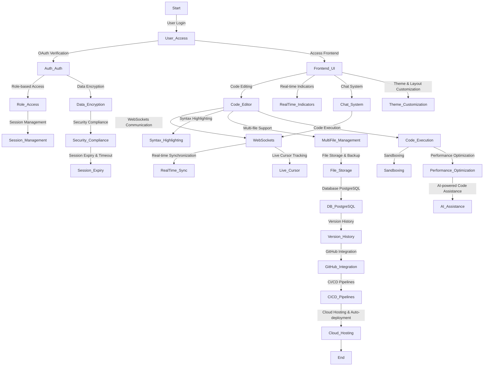

# GEHU_Project-Based_Learning_Sem6
This repository contains materials related to my project-based learning during the 6th semester at Graphic Era Hill University.

## System Architecture (High Level Diagram):

